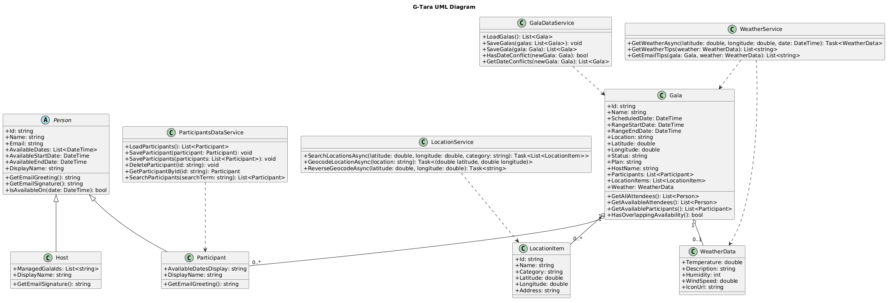

<div align="center">

<h1 align="center">G-Tara — Gala Planning Assistant</h1>
G-Tara is a Windows Forms application for planning and coordinating galas. Hosts can schedule events, manage participants and availability, select locations, and share plans with attendees.

</div>

## Overview
In G-Tara, users organize a gala from start to finish. They pick dates, locations, and participants, then finalize a plan with weather-aware tips and optional email updates.

**Highlights:**
- 📅 Gala scheduling with date ranges
- ⌚ Participant management with availability
- 📍 Location search and map pinning
- ⛅ Weather lookup for the event date
- ✉️ Optional email dispatch to Gmail participants

---

## UML Diagram


## Features and Functionalities of the System
- Create, edit, and delete galas with date ranges and plans.
- Manage participants and their availability.
- Search locations and pick coordinates via an embedded map.
- Fetch and display weather data for the scheduled date.
- Send plan emails to Gmail participants.

## Explanation of How the Program Works
- The main window lists galas and lets the user add, edit, or delete them.
- Add/Edit Gala handles date selection, location lookup, and participant selection.
- Services persist data to JSON files and call external APIs for weather and location search.
- Participants are managed in a dedicated dialog with availability selection.
- Users can pick galas and automatically send them to the listed participants of the said gala.

## OOP Principles Used
### Encapsulation
- `Gala` and `Person` keep related state and rules together (e.g., availability checks).
- External code interacts with public methods like `IsAvailableOn()` rather than modifying internal logic.

```csharp
public abstract class Person
{
	public List<DateTime> AvailableDates { get; set; } = new();
	public DateTime AvailableStartDate { get; set; }
	public DateTime AvailableEndDate { get; set; }

	public bool IsAvailableOn(DateTime date)
	{
		if (AvailableDates.Count > 0)
		{
			return AvailableDates.Any(d => d.Date == date.Date);
		}

		if (AvailableStartDate != default || AvailableEndDate != default)
		{
			return AvailableStartDate.Date <= date.Date && AvailableEndDate.Date >= date.Date;
		}

		return false;
	}
}
```

### Abstraction
- `Person` defines shared data and behavior for different people types.
- `Participant` and `Host` reuse the same base model while focusing on their own roles.

```csharp
public abstract class Person
{
  public string Name { get; set; } = string.Empty;
  public string Email { get; set; } = string.Empty;

  public bool IsAvailableOn(DateTime date)
  {
    return true;
  }
}

public class Participant : Person
{
    // code n stuffs
}

public class Host : Person
{
    // code n stuffs
}
```

### Inheritance
- `Participant` and `Host` inherit from `Person`, sharing identity and availability fields.

```csharp
public class Participant : Person
{
	public string AvailableDatesDisplay { get; }
}

public class Host : Person
{
	public List<string> ManagedGalaIds { get; set; } = new();
}
```

### Polymorphism
- The app uses a base `Person` type while subclasses change email phrasing through overrides.

```csharp
public abstract class Person
{
	public string Name { get; set; } = string.Empty;
	public virtual string GetEmailGreeting()
	{
		return string.IsNullOrWhiteSpace(Name) ? "Hello!" : $"Hello, {Name}!";
	}
}

public class Participant : Person
{
	public override string GetEmailGreeting()
	{
		return string.IsNullOrWhiteSpace(Name) ? "Tara na!" : $"Tara na, {Name}!";
	}
}

public class Host : Person
{
	public override string GetEmailGreeting()
	{
		return string.IsNullOrWhiteSpace(Name) ? "Hello!" : $"Hello, {Name}!";
	}
}
```

## Instructions on How to Run the Application
1. Open the solution in Visual Studio.
2. Restore NuGet packages if prompted.
3. Set environment variables as needed:
   - `OPENWEATHER_API_KEY` for weather data.
   - `GMAIL_USER` and `GMAIL_PASS` for email sending.
   - Optional: `SAVE_DIR` to override the default save folder.
4. Build and run the project.

## ✨ Authors & Credits

<div align="center">

<table>
  <tr>
    <td align="center" width="180">
      <br/>
      <strong>Marjol Alvendia</strong><br/>
      Debugger / Developer<br/>
      <a href="https://github.com/ShinHank" target="_blank">
        
      </a>
    </td>
    <td align="center" width="180">
      <br/>
      <strong>Juan Miguel Andal</strong><br/>
      Quality Assurance / Developer<br/>
      <a href="https://github.com/JuanMiguelAndal" target="_blank">
        
      </a>
    </td>
    <td align="center" width="180">
      <br/>
      <strong>Benedict Borillo</strong><br/>
      API integration / Developer<br/>
      <a href="https://github.com/SlimeDip" target="_blank">
        
      </a>
    </td>
    <td align="center" width="180">
      <br/>
      <strong>Ron Emmanuel Guial</strong><br/>
      UI/UX / Developer<br/>
      <a href="https://github.com/Maca-roni" target="_blank">
        
      </a>
    </td>
  </tr>
</table>

<div align="center">

✨ Salamat sa aming prof, <strong>Ma'am Fatima Marie Agdon,</strong> ✨  
sa Diyos, at sa lahat ng sumuporta sa AOOP final project na ito. 💛

<br>

<a href="https://github.com/marieemoiselle" target="_blank">
  
</a>

<br><br>

🖤 Support our professor by checking out her GitHub! 🖤  

</div>

</div>
